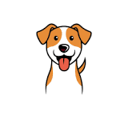

# CroqScan 🐾



**Scanner Santé Produits Animaux** - Votre compagnon de confiance pour vérifier la qualité et la sécurité des produits pour animaux.

Comme Yuka pour les humains, CroqScan vous aide à scanner et évaluer la nourriture et les produits pour animaux afin d'assurer la meilleure santé à vos compagnons à poils, à plumes et à écailles.

**Plateformes supportées :** Android 📱 | iOS 🍎

---

## 🚀 Fonctionnalités

### ✅ Fonctionnalités Principales

- **Scanner de Codes-Barres** - Scannez les codes-barres des produits avec votre caméra
- **Recherche de Produits** - Parcourez et recherchez dans notre base de données
- **Score de Santé** - Score 0-100 avec évaluations par code couleur
- **Analyse Détaillée** - Consultez les ingrédients, infos nutritionnelles, avertissements et avantages
- **Support Multi-Animaux** - Produits catégorisés pour chiens, chats, oiseaux, lapins et plus

### 🎨 Expérience Utilisateur

- **Interface Magnifique** - Design moderne et épuré avec Material 3
- **Navigation Intuitive** - Simple et facile à utiliser
- **Design de Confiance** - Interface professionnelle qui inspire confiance
- **Responsive** - Animations fluides et performances rapides

### 📊 Informations Produit

- **Score de Santé** (0-100) avec indicateurs visuels :
  - 🟢 75-100 : Excellent
  - 🟡 50-74 : Bon
  - 🟠 25-49 : Moyen
  - 🔴 0-24 : Mauvais
- **Liste d'Ingrédients** - Liste complète de tous les ingrédients
- **Analyse Nutritionnelle** - Teneur en protéines, graisses, fibres, humidité, cendres
- **Avertissements** - Alertes sur les ingrédients nocifs ou préoccupants
- **Avantages** - Points forts des qualités positives

---

## 📋 Prérequis

- Flutter SDK (version >=3.9.2)
- Pour iOS : Xcode installé et configuré
- Pour Android : Android Studio avec SDK Android
- Un appareil avec caméra (pour scanner)

---

## 🛠️ Installation

1. Clonez le repository :

```bash
git clone <votre-repo>
cd CroqScan
```

2. Installez les dépendances :

```bash
flutter pub get
```

3. Pour iOS, installez les pods :

```bash
cd ios
pod install
cd ..
```

---

## 🏃 Lancement de l'Application

### Android

```bash
flutter run
```

ou pour un build de production :

```bash
flutter build apk --release
```

### iOS

```bash
flutter run
```

ou pour un build de production :

```bash
flutter build ios --release
```

**Note iOS** : Vous devez avoir un compte développeur Apple et configurer la signature du code dans Xcode. Voir la [documentation Flutter iOS](https://docs.flutter.dev/platform-integration/ios/setup).

---

## 📱 Comment Utiliser

### 1. Scanner un Produit

- Ouvrez l'app
- Appuyez sur "Scanner un Produit"
- Pointez votre caméra vers le code-barres
- Consultez le score de santé et les détails instantanés

### 2. Rechercher des Produits

- Ouvrez l'app
- Appuyez sur "Rechercher des Produits"
- Tapez le nom du produit ou de la marque
- Parcourez et appuyez pour voir les détails

### 3. Comprendre le Score

- **Excellent (75-100)** : Haute qualité, sûr pour votre animal
- **Bon (50-74)** : Acceptable mais pourrait être mieux
- **Moyen (25-49)** : Non recommandé, vérifiez les alternatives
- **Mauvais (0-24)** : À éviter - contient des ingrédients nocifs

---

## 🔑 Permissions

L'application nécessite les permissions suivantes :

- **Caméra** : Pour scanner les codes-barres des produits
- **Galerie photo** : Pour importer des images (fonctionnalité future)
- **Stockage** : Pour sauvegarder l'historique des scans (fonctionnalité future)

---

## 📦 Dépendances Principales

- `camera` : Accès à la caméra
- `image_picker` : Sélection d'images
- `permission_handler` : Gestion des permissions
- `mobile_scanner` : Scanner QR/codes-barres
- `path_provider` : Accès aux répertoires système

---

## 🏗️ Structure du Projet

```
lib/
  ├── main.dart                 # Point d'entrée de l'application
  ├── constants/
  │   └── app_colors.dart       # Palette de couleurs et thématique
  ├── models/
  │   └── product.dart          # Modèles de données produit et nutritionnelles
  ├── data/
  │   └── sample_products.dart  # Base de données de produits d'exemple
  ├── screens/
  │   ├── home_screen.dart      # Écran d'accueil principal
  │   ├── scanner_screen.dart   # Scanner de codes-barres
  │   ├── search_screen.dart    # Recherche de produits
  │   └── product_details_screen.dart # Vue détails produit
  └── widgets/
      ├── score_badge.dart      # Badge de score de santé
      └── product_card.dart     # Élément de liste de produits

android/                         # Configuration native Android
ios/                             # Configuration native iOS
assets/                          # Images et icônes
```

---

## 🎨 Philosophie de Design

CroqScan est conçu avec trois principes clés :

1. **Confiance** - Design professionnel qui transmet fiabilité et expertise
2. **Simplicité** - Facile à utiliser pour tous, des utilisateurs avertis aux débutants
3. **Clarté** - Indicateurs visuels clairs et informations simples

### Système de Couleurs

- **Bleu (#2D9CDB)** - Couleur primaire, représente la confiance et la santé
- **Vert (#27AE60)** - Produits excellents, choix sûr
- **Jaune/Orange (#F2994A)** - Attention, produits moyens
- **Rouge (#EB5757)** - Avertissement, mauvaise qualité

---

## 🔧 Configuration

### Android

- **ID d'Application** : `com.croqscan.app`
- **SDK Min** : 21 (Android 5.0)
- **SDK Cible** : Dernière version stable

### iOS

- **Bundle ID** : À configurer dans Xcode
- **Cible de Déploiement** : iOS 12.0+

---

## 📝 Feuille de Route

### Actuel (v1.0)

- [x] Scanner de codes-barres
- [x] Recherche de produits
- [x] Système de score de santé
- [x] Informations détaillées sur les produits
- [x] Base de données de produits d'exemple

### Fonctionnalités Prévues

- [ ] Intégration API réelle
- [ ] Comptes utilisateur
- [ ] Historique des scans
- [ ] Liste de favoris
- [ ] Comparaison de produits
- [ ] Partage de résultats
- [ ] Évaluations communautaires
- [ ] Profils d'animaux personnalisés
- [ ] Mode hors ligne
- [ ] Support multi-langues

---

## 🤝 Contribution

Les contributions sont les bienvenues ! Cette app est conçue pour aider les propriétaires d'animaux à faire de meilleurs choix pour la santé de leurs animaux.

Si vous souhaitez contribuer :

1. Forkez le repository
2. Créez une branche de fonctionnalité
3. Effectuez vos modifications
4. Soumettez une pull request

---

## 📄 Licence

Ce projet est sous licence MIT.

---

## 🐾 À Propos

CroqScan a été créé pour aider les propriétaires d'animaux à prendre des décisions éclairées sur les produits qu'ils achètent pour leurs compagnons bien-aimés. Tout comme Yuka aide les humains à mieux manger, CroqScan aide les animaux à vivre plus sainement.

**Fait avec ❤️ pour les animaux et leurs humains**

---

## 📞 Support

Pour des questions, demandes de fonctionnalités ou rapports de bugs, veuillez ouvrir une issue sur GitHub.

---

## 🙏 Remerciements

- Inspiré par l'application Yuka
- Merci à la communauté Flutter
- Icônes par Flutter Material Icons
- Données d'exemple à des fins de démonstration uniquement

---

**Rappel : Consultez toujours votre vétérinaire pour les besoins alimentaires spécifiques et les problèmes de santé de vos animaux !** 🐕 🐈 🐦
